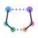
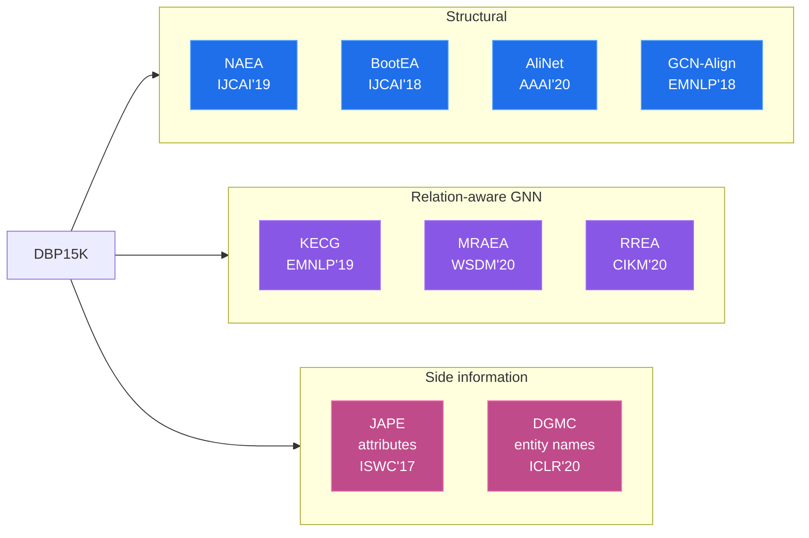

<!--
  README homepage for EntityAlignment-Nexus.
  NOTE: replace Z-Nadjib below with your GitHub username/org once the repo is pushed.
-->

<div align="center">



<a href="https://github.com/Z-Nadjib/EntityAlignment-Nexus">
  
</a>

<p>
  
</p>

<p>
  <a href="#-models"></a>
  <a href="#-results"></a>
  
  
  
</p>

<p>
  
  
  
  
</p>

<h3>
  <a href="https://Z-Nadjib.github.io/EntityAlignment-Nexus/">Documentation</a> &nbsp;|&nbsp;
  <a href="#-quickstart">Quickstart</a> &nbsp;|&nbsp;
  <a href="#-results">Results</a> &nbsp;|&nbsp;
  <a href="#-roadmap">Roadmap</a>
</h3>

</div>

---

## Mission

> **One place to find, run and compare entity-alignment models on DBP15K.**

Entity Alignment (EA) research is scattered across dozens of repositories, each with its own
data format, training loop and evaluation quirks. **EntityAlignment-Nexus** brings nine landmark methods
together under a **single, readable codebase** with a **shared data layer, shared metrics and a
shared trainer pattern**, so you can study a method, reproduce its numbers, and compare it to
the others without re-learning a new project every time.

Every model ships **twice**:

- as an **installable package** (`code/`) driven by one YAML config per model, and
- as a **self-contained notebook** (`Notebook/`) that re-implements the whole engine inline,
  documented cell by cell, so you can read a method top to bottom in one file.

---

## Highlights

<table>
<tr>
<td width="50%" valign="top">

**Unified & faithful**
- 9 models, 1 data loader, 1 metrics module, 1 trainer pattern
- DBP15K `zh_en` / `ja_en` / `fr_en`, the standard 30% seed split
- CSLS, MRR, Hit@1/5/10 reported the same way for everyone

</td>
<td width="50%" valign="top">

**Reproducible & transparent**
- Timestamped run dirs: config snapshot, logs, CSV, checkpoints, curves
- Paper-level (or above) on several models, gaps documented honestly
- "Debugging lessons" notes explaining *what actually made each model work*

</td>
</tr>
</table>

---

## The model collection



| Model | Venue | Family | One-line idea | Page |
|-------|:-----:|--------|---------------|:----:|
| **NAEA** | IJCAI 2019 | structural + attention | Neighbourhood-aware GAT over translation-consistent messages | [docs](docs/models/naea.md) |
| **BootEA** | IJCAI 2018 | structural + bootstrap | AlignE TransE + alignment-by-swapping + editable MWGM self-training | [docs](docs/models/bootea.md) |
| **AliNet** | AAAI 2020 | gated multi-hop GNN | 1-hop GCN + attentional 2-hop, fused by a learned gate | [docs](docs/models/alinet.md) |
| **KECG** | EMNLP 2019 | GNN + TransE | Shared diagonal GAT cross-graph + knowledge-embedding loss | [docs](docs/models/kecg.md) |
| **GCN-Align** | EMNLP 2018 | GCN | Functionality-weighted adjacency + shared 2-layer GCN (SE) | [docs](docs/models/gcnalign.md) |
| **JAPE** | ISWC 2017 | TransE + attributes | Merged-seed TransE fused with a TF-IDF attribute channel | [docs](docs/models/jape.md) |
| **DGMC** | ICLR 2020 | name features + GNN | GloVe name features + sparse top-k neighbourhood consensus | [docs](docs/models/dgmc.md) |
| **MRAEA** | WSDM 2020 | meta-relation GNN | Relation + inverse aware GAT + iterative mutual-NN bootstrap | [docs](docs/models/mraea.md) |
| **RREA** | CIKM 2020 | relational reflection | Householder reflection aggregation + turn-based CSLS bootstrap | [docs](docs/models/rrea.md) |

---

## Results

DBP15K **`zh_en`**, 30% seed. **Bold** = this repo matches or beats the paper.
Full tables for `ja_en` / `fr_en` and training curves live in the [results page](docs/results.md).

| Model | Hit@1 (paper) | **Hit@1 (here)** | Hit@10 (paper) | **Hit@10 (here)** | MRR (paper) | **MRR (here)** |
|-------|:----:|:----:|:----:|:----:|:----:|:----:|
| NAEA | 0.650 | ~0.62 | 0.867 | ~0.86 | 0.720 | ~0.70 |
| BootEA | 0.629 | ~0.56 | 0.847 | ~0.85 | 0.703 | ~0.66 |
| AliNet | 0.539 | ~0.53 | 0.826 | ~0.81 | 0.628 | ~0.63 |
| KECG | 0.477 | ~0.42 | 0.835 | ~0.73 | 0.598 | ~0.52 |
| GCN-Align (SE) | 0.384 | ~0.38 | 0.703 | ~0.68 | - | ~0.49 |
| JAPE (SE+AE) | 0.412 | **0.425** | 0.745 | **0.761** | 0.490 | **0.537** |
| DGMC (names) | 0.801 | 0.767 | 0.875 | 0.840 | - | - |
| MRAEA (base) | 0.638 | **0.659** | 0.882 | **0.898** | 0.729 | **0.746** |
| MRAEA (+iter) | 0.757 | 0.746 | 0.930 | **0.930** | 0.827 | 0.814 |
| RREA (basic) | 0.715 | 0.712 | 0.929 | **0.934** | 0.794 | 0.793 |
| **RREA (semi)** | 0.801 | **0.805** | 0.948 | **0.950** | 0.857 | **0.859** |

<div align="center">

**RREA (semi-supervised) is the current top performer in this repo.**
DGMC, which uses entity *names*, even **beats the paper on `fr_en` (Hit@1 0.939 vs 0.933)**.

</div>

---

## Quickstart

```bash
# 1. install the package (editable)
cd code
pip install -e .

# 2. train any model from its YAML config
python -m src.main --config ../configs/rrea_dbp15k.yaml          # RREA (semi-supervised)
python -m src.main --config ../configs/jape_dbp15k.yaml          # JAPE (SE + attributes)
python -m src.main --config ../configs/dgmc_dbp15k.yaml --lang zh_en   # DGMC (entity names)

# 3. override on the fly
python -m src.main --config ../configs/mraea_dbp15k.yaml --lang fr_en --epochs 2000
```

Each run writes a timestamped folder (config snapshot, `training.txt`, `loss.csv`,
`metrics.csv`, dark-theme curves, checkpoints, embeddings).

> Prefer reading over running? Open any notebook in [`Notebook/`](Notebook/) - each one
> re-implements the full pipeline inline, documented cell by cell.

---

## Repository layout

```text
EntityAlignment-Nexus/
├── code/                  # installable package (pip install -e .)
│   └── src/
│       ├── data.py        # DBP15K loading + graph builders + samplers
│       ├── trainer.py     # all 9 trainers (shared pattern)
│       ├── main.py        # CLI entry point (YAML-driven)
│       ├── models/        # one file per model + its losses
│       └── utils/         # config, logging, metrics (MRR/Hit@k/CSLS), plotting
├── configs/               # one YAML per model
├── Notebook/              # 9 self-contained, documented notebooks
└── docs/                  # MkDocs Material documentation site
#  (training runs are written to a git-ignored logs/ directory)
```

---

## Documentation

A full **MkDocs Material** site (dark + light theme, Mermaid diagrams, math, training curves)
covers every model in depth:

```bash
pip install -r requirements-docs.txt
mkdocs serve        # live preview at http://127.0.0.1:8000
```

It is deployed automatically to **GitHub Pages** on every push to `main`
(see [`.github/workflows/docs.yml`](.github/workflows/docs.yml)).

---

## Roadmap

The repo is built to grow. Next up: **transformer-based** entity-alignment models
(self-attention encoders, pre-trained language model initialisation, and large-model
EA pipelines). See the [roadmap](docs/roadmap.md) for the shortlist and how to propose a model.

---

## Contributing

Contributions are very welcome - a new model, a stronger config, a `ja_en`/`fr_en` run, or a
doc fix. The shared `data.py` / `trainer.py` / `metrics.py` make adding a model mostly a matter
of writing `models/<your_model>.py`, a trainer and a YAML. See the [about page](docs/about.md).

## Citation

```bibtex
@software{ea_dbp15k,
  title  = {EntityAlignment-Nexus: A Unified Framework of Entity Alignment Models on DBP15K},
  author = {Nadjib ZAHAF},
  year   = {2026},
  url    = {https://github.com/Z-Nadjib/EntityAlignment-Nexus}
}
```

## License

Released under the [MIT License](code/LICENSE). The original papers and the DBP15K benchmark
remain the property of their respective authors.

<div align="center">

</div>
