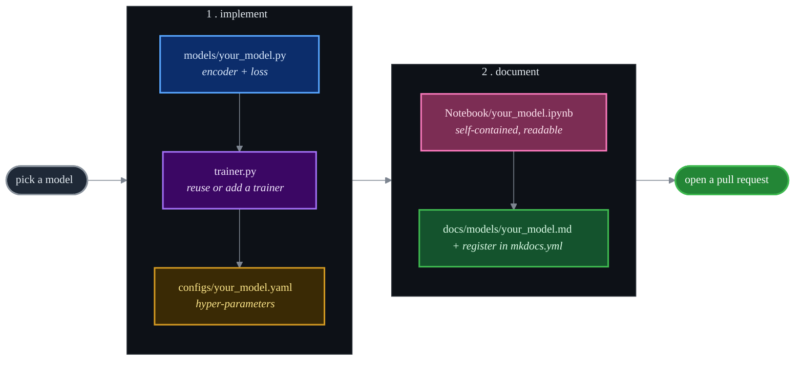

# About & contributing

## Why a unified EA repo?

Entity-alignment research moves fast, but its code does not travel well: every method ships its
own data reader, training loop and evaluation script, often in incompatible frameworks. That
makes fair comparison and onboarding unnecessarily painful.

**EntityAlignment-Nexus exists to serve the entity-alignment community** by collecting models behind a single
clean engine, so that:

- a newcomer can read one method and understand the rest;
- a researcher can reproduce a number with one command;
- a practitioner can compare methods on equal footing.

## Design principles

- **One engine, many models.** A shared `data.py`, `trainer.py` and `metrics.py`; each model is
  just an encoder + loss + a YAML config.
- **Read it or run it.** Every model exists both as a package module and as a self-contained,
  documented notebook.
- **Honest reporting.** Where we fall short of a paper, the gap is stated and explained rather
  than hidden.
- **Reproducible by construction.** Every run snapshots its exact config and writes logs, CSVs,
  curves and checkpoints.

## How to add a model



1. **Model** - add `code/src/models/<your_model>.py` with the encoder and its loss functions.
2. **Trainer** - reuse an existing trainer or add one in `code/src/trainer.py`.
3. **Config** - add `configs/<your_model>.yaml`.
4. **Notebook** - mirror an existing notebook so the method can be read inline.
5. **Docs** - add `docs/models/<your_model>.md` following the page template, and register it in
   `mkdocs.yml`.

## Building the docs

```bash
pip install -r requirements-docs.txt
mkdocs serve          # local preview
mkdocs build          # static site into site/
```

The site deploys to GitHub Pages automatically on push to `main`
([`.github/workflows/docs.yml`](https://github.com/Z-Nadjib/EntityAlignment-Nexus/blob/main/.github/workflows/docs.yml)).

## Citation

```bibtex
@software{ea_dbp15k,
  title  = {EntityAlignment-Nexus: A Unified Framework of Entity Alignment Models on DBP15K},
  author = {Nadjib ZAHAF},
  year   = {2026},
  url    = {https://github.com/Z-Nadjib/EntityAlignment-Nexus}
}
```

Please also cite the **original paper** of any model you use - links are on each model page.

## License

Released under the [MIT License](https://github.com/Z-Nadjib/EntityAlignment-Nexus/blob/main/code/LICENSE).
The original papers and the DBP15K benchmark remain the property of their respective authors.

## Acknowledgements

Thanks to the authors of NAEA, BootEA, AliNet, KECG, GCN-Align, JAPE, DGMC, MRAEA and RREA, and
to the maintainers of the DBP15K benchmark and the OpenEA study.
