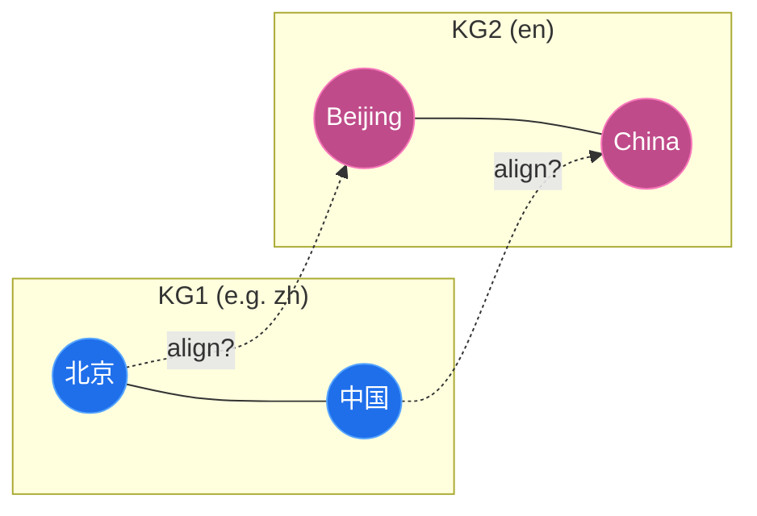

---
hide:
  - navigation
---

# EntityAlignment-Nexus
A unified, faithful, **readable** zoo of Entity Alignment models on the DBP15K benchmark.

  

## Why this project exists

Entity Alignment (EA) finds the entities that refer to the **same real-world thing across two
knowledge graphs** (for example a Chinese DBpedia page and its English counterpart). It is a
crowded field, but the code behind it is fragmented: every paper ships its own data format,
training loop and evaluation script, which makes honest comparison painful.

!!! quote "Mission"
    **EntityAlignment-Nexus is a single, clean home for entity-alignment models on DBP15K** - a shared data
    layer, shared metrics, and a shared trainer pattern so you can read a method, reproduce its
    numbers, and compare it fairly to the rest.

-   :material-cube-outline:{ .lg .middle } **Nine models, one engine**

    ---

    NAEA, BootEA, AliNet, KECG, GCN-Align, JAPE, DGMC, MRAEA and RREA - all on the same
    `data.py` / `trainer.py` / `metrics.py`.

-   :material-chart-line:{ .lg .middle } **Faithful & measured**

    ---

    Paper-level (or above) on several models, with the residual gaps documented honestly and
    real training curves attached.

-   :material-notebook-outline:{ .lg .middle } **Read it or run it**

    ---

    An installable package **and** nine self-contained notebooks that re-implement each method
    inline, cell by cell.

-   :material-rocket-launch-outline:{ .lg .middle } **Built to grow**

    ---

    Transformer-based EA models are on the [roadmap](roadmap.md). Adding a model means writing
    one model file, one trainer and one YAML.

## What is DBP15K?

DBP15K is the reference cross-lingual EA benchmark introduced by JAPE (Sun et al., ISWC 2017).
It contains **three language pairs** built from DBpedia - `zh_en` (Chinese-English),
`ja_en` (Japanese-English) and `fr_en` (French-English) - each with **15,000 gold aligned
entity pairs**. The standard protocol uses **30% of the pairs as training seeds** and the
remaining 70% for testing.

A model encodes the entities of both graphs into a shared space and ranks, for each source
entity, its most likely counterpart in the other graph.

## How models in this repo differ

| Signal used | Models | Intuition |
|-------------|--------|-----------|
| **Structure only** | NAEA, BootEA, AliNet, GCN-Align | aligned entities have similar neighbourhoods |
| **Structure + relations** | KECG, MRAEA, RREA | the *type* of edge matters, not just the neighbour |
| **+ attributes** | JAPE | shared attribute predicates bridge the two vocabularies |
| **+ entity names** | DGMC | word embeddings of the (translated) name are a very strong prior |

## Quick links

- :material-flash: [Getting started](getting-started.md) - install, train, evaluate
- :material-cube: [Models overview](models/index.md) - pick a method and dive in
- :material-trophy: [Results](results.md) - full tables and training curves
- :material-map: [Roadmap](roadmap.md) - what's coming next
- :material-information: [About & contributing](about.md)
