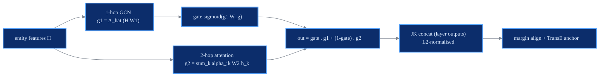

# AliNet

gated multi-hop GNN

> **Knowledge Graph Alignment Network with Gated Multi-hop Neighborhood Aggregation**
> Zequn Sun, Chengming Wang, Wei Hu, Muhao Chen, Jian Dai, Wei Zhang, Yuzhong Qu - *AAAI 2020*
> [:material-file-document: Paper](https://arxiv.org/pdf/1911.08936v1) &nbsp;|&nbsp; [:material-code-tags: `models/alinet.py`](https://github.com/Z-Nadjib/EntityAlignment-Nexus/blob/main/code/src/models/alinet.py) &nbsp;|&nbsp; [:material-notebook: notebook](https://github.com/Z-Nadjib/EntityAlignment-Nexus/blob/main/Notebook/03_alinet_dbp15k.ipynb)

!!! abstract "Idea in one sentence"
    Two aligned entities often have **non-isomorphic 1-hop neighbourhoods**, so AliNet also
    aggregates the **2-hop** neighbourhood (with attention) and fuses the two scales with a
    learned **gate**.

## Architecture

## Components

- **1-hop aggregation** over the symmetrically normalised adjacency
  $\hat{A} = \tilde{D}^{-1/2}(A+I)\tilde{D}^{-1/2}$.
- **2-hop attention** over capped/sampled 2-hop edges (distant neighbours are noisier).
- **Gate** that learns to blend the 1-hop and 2-hop signals.
- **Relation-aware (TransE) loss** $\lVert z_h + r - z_t\rVert$ on the GNN representations - a
  structural anchor for **every** entity, not just the 11% seeds.
- The representation is the **JK concatenation of layer outputs** (not the raw embedding).

## Losses

Margin-ranking alignment with mixed epsilon-truncated hard negatives:

$$\mathcal{L}_{\text{align}} = \big[\, \text{margin} + d(x,y) - d(x, y^-) \,\big]_+ \quad(\text{+ left})$$

plus the relation anchor on sampled triples:

$$\mathcal{L}_{\text{rel}} = \big[\, \text{margin} + \lVert z_h + r - z_t\rVert - \lVert z_h + r - z_{t^-}\rVert \,\big]_+$$

## Results

DBP15K `zh_en`, 30% seed.

| | Hit@1 | Hit@10 | MRR |
|---|:---:|:---:|:---:|
| AliNet (paper) | 0.539 | 0.826 | 0.628 |
| **This repo** | ~0.53 | ~0.81 | ~0.63 |

<figure markdown>
  { width="640" }
  <figcaption>Test metrics over training (this repo, zh_en).</figcaption>
</figure>

!!! note "Debugging lessons (the decisive ones)"
    - **Linear propagation** (no ReLU between layers): a ReLU GCN caps at ~0.20 Hit@1, the linear
      version reaches ~0.40 - the ReLU destroys the structural signal.
    - **Relation-aware loss is the decisive link**: it anchors all entities (MeanRank 200 -> 75).
      Without it, the model plateaus at the GCN-Align level.
    - **JK = layer outputs only**: including the raw per-entity embedding lets the model memorise
      seeds (train Hit@1 = 1.0, test ~ 0).
    - **Hard negatives** are harmful *without* the relation anchor (they scatter the tail) and
      beneficial *with* it (Hit@1 0.45 -> 0.53).
    - 2 layers (3+ over-smooths); 2-hop attention is chunked for memory.

## References

- Sun et al., *AliNet*, AAAI 2020.
- Wang et al., *GCN-Align*, EMNLP 2018.
- Lample et al., *CSLS*, ICLR 2018.
