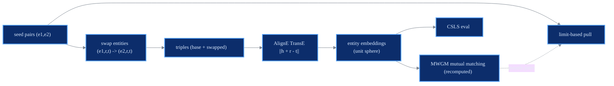

# BootEA

structural + bootstrap

> **Bootstrapping Entity Alignment with Knowledge Graph Embedding**
> Zequn Sun, Wei Hu, Qingheng Zhang, Yuzhong Qu - *IJCAI 2018*
> [:material-file-document: Paper](https://www.ijcai.org/proceedings/2018/0611.pdf) &nbsp;|&nbsp; [:material-code-tags: `models/bootea.py`](https://github.com/Z-Nadjib/EntityAlignment-Nexus/blob/main/code/src/models/bootea.py) &nbsp;|&nbsp; [:material-notebook: notebook](https://github.com/Z-Nadjib/EntityAlignment-Nexus/blob/main/Notebook/02_bootea_dbp15k.ipynb)

!!! abstract "Idea in one sentence"
    Learn alignment-oriented TransE embeddings (**AlignE**), make aligned pairs share relational
    context by **swapping** them in each other's triples, and grow the training set with an
    **editable, recomputed mutual one-to-one matching**.

## Architecture

## Components

- **AlignE embedding.** TransE with a **limit-based** loss (absolute margins) and entities
  constrained to the unit sphere; relations are free.
- **Epsilon-truncated negatives.** Triples are corrupted with the entity's **nearest same-KG
  neighbours** (hard negatives), refreshed periodically.
- **Alignment by swapping.** For a labelled pair $(e_1, e_2)$, swapping the two entities in each
  other's triples makes them share relational context, pulling their embeddings together - the
  core of BootEA.
- **Editable MWGM bootstrapping.** A mutual one-to-one matching over the unlabelled pool,
  recomputed from scratch each round, so wrong pairs are dropped as the model improves.

## Loss

$$
\mathcal{O}_e = \sum_{\tau \in D^+} \big[ f(\tau) - \gamma_1 \big]_+
\;+\; \mu \sum_{\tau' \in D^-} \big[ \gamma_2 - f(\tau') \big]_+
$$

plus a light limit-based pull on the labelled pairs. There is **no neighbourhood aggregation** -
the representation is just the normalised entity embedding (this is what distinguishes BootEA
from NAEA).

## Training recipe

| Lever | Setting |
|-------|---------|
| `model.embed_dim` | 75 (paper) |
| `train.pos/neg_margin_kge` | limit-based margins $\gamma_1, \gamma_2$ |
| `train.swapping.cap_per_role` | cap on swapped triples per entity |
| `train.bootstrap.threshold` | confidence to accept a pseudo pair |
| `train.eps_truncated.num_candidates` | hard-negative pool size |

!!! warning "Swap only the gold seeds"
    Swapping is restricted to the **gold seed pairs**. Letting bootstrapped (possibly wrong)
    pairs generate swapped triples corrupts the triple set and collapses training.

## Results

DBP15K `zh_en`, 30% seed.

| | Hit@1 | Hit@10 | MRR |
|---|:---:|:---:|:---:|
| BootEA (paper) | 0.629 | 0.847 | 0.703 |
| **This repo** | ~0.56 | ~0.85 | ~0.66 |

<figure markdown>
  { width="640" }
  <figcaption>Test metrics over training (this repo, zh_en).</figcaption>
</figure>

!!! note "Debugging lessons"
    - The reliable Hit@1 driver here is the **contrastive alignment loss** with hard negatives,
      not the swapping alone.
    - `csls_k` tuning at evaluation gave a measurable lift.
    - Hit@10/MRR essentially match the paper; the residual Hit@1 gap is the known hard-to-match
      part for purely structural models.

## References

- Sun et al., *BootEA*, IJCAI 2018.
- Bordes et al., *TransE*, NeurIPS 2013.
- Lample et al., *CSLS*, ICLR 2018.
