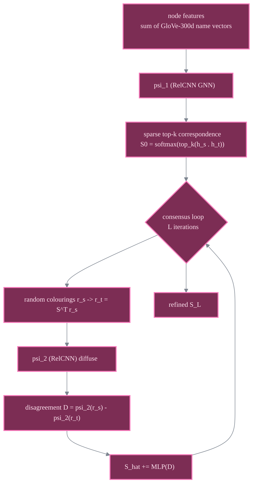

# DGMC

entity names + GNN

> **Deep Graph Matching Consensus**
> Matthias Fey, Jan E. Lenssen, Christopher Morris, Jonathan Masci, Nils M. Kriege - *ICLR 2020*
> [:material-file-document: Paper](https://arxiv.org/abs/2001.09621) &nbsp;|&nbsp; [:material-code-tags: `models/dgmc.py`](https://github.com/Z-Nadjib/EntityAlignment-Nexus/blob/main/code/src/models/dgmc.py) &nbsp;|&nbsp; [:material-notebook: notebook](https://github.com/Z-Nadjib/EntityAlignment-Nexus/blob/main/Notebook/07_dgmc_dbp15k.ipynb)

!!! abstract "Idea in one sentence"
    Use **entity-name word embeddings** as node features, build a sparse top-k correspondence by
    local feature matching, then refine it so that **matched neighbourhoods agree** (consensus).

!!! info "This is the strongest family"
    Unlike the purely structural models, DGMC leans on entity *names* (summed GloVe-300d
    vectors), which is why it reaches Hit@1 in the 0.77-0.94 range rather than 0.4-0.6.

## Architecture

## Components

- **Name features.** Each node feature is the **sum of the GloVe-300d embeddings** of the words
  in its (translated) name.
- **Local matching ($\psi_1$).** A 3-layer RelCNN produces L2-normalised embeddings; the initial
  correspondence keeps the **top-k** targets per source, scored by cosine with a **temperature**.
- **Neighbourhood consensus ($\psi_2$ + MLP).** Random node colourings are pushed through the
  current correspondence; their disagreement after diffusion drives an additive re-ranking so
  that matched neighbourhoods become consistent.
- **Two training phases.** Phase 1 trains only the local matching; phase 2 enables the consensus.

## Results

DBP15K, 30% split. **This repo beats the paper on `fr_en`.**

| Hits@1 | zh_en | ja_en | fr_en |
|--------|:---:|:---:|:---:|
| DGMC (paper) | 0.801 | 0.848 | 0.933 |
| **This repo** | 0.767 | 0.814 | **0.939** |

| Hits@10 | zh_en | ja_en | fr_en |
|---------|:---:|:---:|:---:|
| DGMC (paper) | 0.875 | 0.897 | 0.960 |
| **This repo** | 0.840 | 0.874 | 0.965 |

!!! note "Debugging lessons"
    - **Cosine + temperature is critical**: the summed-name features have wildly varying norms,
      so a raw inner product gives recall@10 ~0.13 vs ~0.69 with cosine. Apply the temperature
      **only inside the softmax**, or it saturates and kills the refinement gain.
    - **dropout 0.2** (not the paper's 0.5): only ~100 full-batch steps, 0.5 under-fits.
    - **k=25** (not 10) gives more contrastive negatives -> better embeddings; **k=50 diverges**.
    - **detach_refine=false**: keep training $\psi_1$ during refinement; its recall keeps rising.
    - The Hits@1 ceiling in the sparse model is the **top-k recall** of the initial matching
      (~0.84 zh vs ~0.87 paper) - that is the ~3 points left on zh/ja.

## References

- Fey et al., *Deep Graph Matching Consensus*, ICLR 2020.
- Xu et al., *Cross-lingual KG Alignment via Graph Matching NN* (GMNN features), ACL 2019.
- Lample et al., *CSLS*, ICLR 2018.
