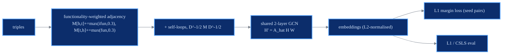

# GCN-Align

GCN (structure channel)

> **Cross-lingual Knowledge Graph Alignment via Graph Convolutional Networks**
> Zhichun Wang, Qingsong Lv, Xiaohan Lan, Yu Zhang - *EMNLP 2018*
> [:material-file-document: Paper](https://aclanthology.org/D18-1032.pdf) &nbsp;|&nbsp; [:material-code-tags: `models/gcnalign.py`](https://github.com/Z-Nadjib/EntityAlignment-Nexus/blob/main/code/src/models/gcnalign.py) &nbsp;|&nbsp; [:material-notebook: notebook](https://github.com/Z-Nadjib/EntityAlignment-Nexus/blob/main/Notebook/05_gcnalign_dbp15k.ipynb)

!!! abstract "Idea in one sentence"
    A **2-layer GCN with weights shared across both graphs** maps structurally equivalent
    entities to nearby embeddings; the adjacency is **weighted by relation functionality**.

## Architecture

## Components

- **Functionality weighting.** For relation $r$, $\text{fun}(r)=\#\text{heads}/\#\text{triples}$
  and $\text{ifun}(r)=\#\text{tails}/\#\text{triples}$. Edge weights accumulate
  $M[h,t]\mathrel{+}=\max(\text{ifun}(r), 0.3)$ and $M[t,h]\mathrel{+}=\max(\text{fun}(r), 0.3)$,
  then self-loops + symmetric normalisation.
- **Shared 2-layer GCN** (structure channel SE), **linear** propagation.
- **L1 margin alignment loss** with random negatives on both sides.

## Loss

$$
\mathcal{L} = \big[\, \lVert z_{e_1}-z_{e_2}\rVert_1 + \gamma - \lVert z_{e_1}-z_{e_2^-}\rVert_1 \,\big]_+ \quad(\text{+ symmetric left side})
$$

## Results

DBP15K `zh_en`, 30% seed (structure channel SE only).

| | Hit@1 | Hit@10 | MRR |
|---|:---:|:---:|:---:|
| GCN-Align SE (paper) | 0.384 | 0.703 | - |
| **This repo** | ~0.38 | ~0.68 | ~0.49 |

<figure markdown>
  { width="640" }
  <figcaption>Test metrics over training (this repo, zh_en).</figcaption>
</figure>

!!! note "Debugging lessons"
    - **L2-normalised output**: with raw embeddings + SGD lr=20 (paper), training diverges (NaN)
      in PyTorch; normalising keeps the L1 margin on a bounded scale.
    - **Linear propagation** beats ReLU for alignment.
    - **k=25 negatives** (the paper's k=5 saturates the loss too early); **Adam lr 1e-3**, ~3000
      epochs, keep the best checkpoint (best point is early, then a slight decline).
    - **dim 300** (paper 200) gains the last Hit@10 points; CSLS at evaluation.

## References

- Wang et al., *GCN-Align*, EMNLP 2018.
- Kipf & Welling, *GCN*, ICLR 2017.
- Lample et al., *CSLS*, ICLR 2018.
