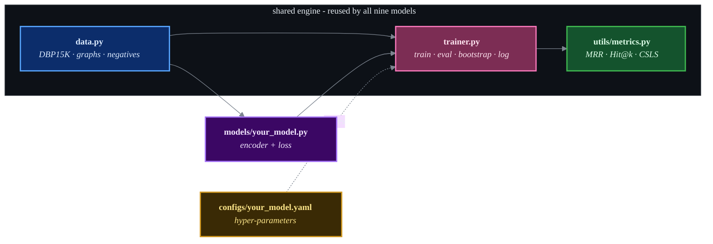

# Models overview

Nine entity-alignment methods, grouped by the kind of signal they exploit. Click any card to
open its dedicated page (idea, architecture diagram, losses, training recipe, results and the
debugging lessons that actually made it reach paper level).

-   structural **[NAEA](naea.md)** - IJCAI 2019

    ---

    Neighbourhood-aware GAT over translation-consistent neighbour messages, with hard negatives
    and recomputed bootstrapping.

-   structural **[BootEA](bootea.md)** - IJCAI 2018

    ---

    AlignE (limit-based TransE) + alignment-by-swapping + editable MWGM self-training.

-   structural **[AliNet](alinet.md)** - AAAI 2020

    ---

    Gated multi-hop GNN: 1-hop GCN fused with attentional 2-hop, anchored by a relation-aware loss.

-   structural **[GCN-Align](gcnalign.md)** - EMNLP 2018

    ---

    Functionality-weighted adjacency + a shared 2-layer GCN (structure channel).

-   relation-aware **[KECG](kecg.md)** - EMNLP 2019

    ---

    Shared diagonal multi-head GAT cross-graph + a knowledge-embedding (TransE) loss, alternated.

-   relation-aware **[MRAEA](mraea.md)** - WSDM 2020

    ---

    Meta-relation-aware GAT (a relation and its inverse differ) + iterative mutual-NN bootstrap.

-   relation-aware **[RREA](rrea.md)** - CIKM 2020

    ---

    Relational reflection (Householder) aggregation + turn-based CSLS bootstrap. **Top performer.**

-   attributes **[JAPE](jape.md)** - ISWC 2017

    ---

    Merged-seed TransE fused with a TF-IDF attribute channel. The paper that introduced DBP15K.

-   entity names **[DGMC](dgmc.md)** - ICLR 2020

    ---

    GloVe entity-name features + sparse top-k neighbourhood consensus. Beats the paper on `fr_en`.

## At a glance

| Model | Encoder | Alignment signal | Loss | Self-training | Eval |
|-------|---------|------------------|------|:-------------:|:----:|
| NAEA | GAT (neighbour messages) | structure | limit-based margin | recomputed | CSLS |
| BootEA | embedding (AlignE) | structure | limit-based TransE + pull | MWGM | CSLS |
| AliNet | gated multi-hop GNN | structure + relations | margin + TransE anchor | optional | CSLS |
| KECG | diagonal multi-head GAT | structure + relations | triplet + TransE | - | CSLS |
| GCN-Align | shared 2-layer GCN | structure | L1 margin | - | L1 / CSLS |
| JAPE | TransE (merged seeds) | structure + attributes | margin + fused AE | - | CSLS |
| DGMC | RelCNN + consensus | entity names | sparse NLL | consensus | top-k |
| MRAEA | meta-relation GAT | structure + relations | L1 margin | mutual-NN | cosine/CSLS |
| RREA | relational-reflection GAT | structure + relations | L1 margin | CSLS mutual-NN | CSLS |

## Shared building blocks

All models reuse the same engine, so reading one makes the rest easy:

See the [results page](../results.md) for the full benchmark tables and training curves.
