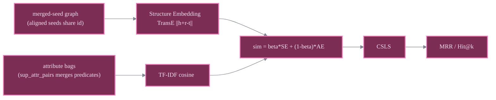

# JAPE

TransE + attributes

> **Cross-lingual Entity Alignment via Joint Attribute-Preserving Embedding**
> Zequn Sun, Wei Hu, Chengkai Li - *ISWC 2017* (the paper that introduced DBP15K)
> [:material-file-document: Paper](https://arxiv.org/pdf/1708.05045) &nbsp;|&nbsp; [:material-code-tags: `models/jape.py`](https://github.com/Z-Nadjib/EntityAlignment-Nexus/blob/main/code/src/models/jape.py) &nbsp;|&nbsp; [:material-notebook: notebook](https://github.com/Z-Nadjib/EntityAlignment-Nexus/blob/main/Notebook/06_jape_dbp15k.ipynb)

!!! abstract "Idea in one sentence"
    Run TransE on a **merged-seed graph** (aligned seeds share one id, bridging the two KGs) and
    **fuse** the structure similarity with a **cross-KG TF-IDF attribute** similarity at scoring
    time.

## Architecture

## Components

- **Structure Embedding (SE).** Plain TransE over both KGs in **one** merged graph; because
  aligned seeds share ids, TransE propagates the alignment to the test entities.
- **Attribute Embedding (AE).** A cross-KG, shared-vocabulary bag of attribute predicates;
  `sup_attr_pairs` merges the zh<->en predicates so the vocabularies overlap. TF-IDF cosine
  similarity refines SE.
- **Fusion + CSLS.** $\text{sim} = \beta\,\text{SE} + (1-\beta)\,\text{AE}$ with $\beta = 0.9$
  (SE-dominant), then CSLS on the fused matrix.

## Results

DBP15K, 30% seed. This repo **meets or beats the paper on all three pairs**.

| Pair | Hit@1 (paper) | **Hit@1 (here)** | Hit@10 (paper) | **Hit@10 (here)** | MRR (paper) | **MRR (here)** |
|------|:---:|:---:|:---:|:---:|:---:|:---:|
| zh_en | 0.412 | **0.425** | 0.745 | **0.761** | 0.490 | **0.537** |
| ja_en | - | 0.368 | - | 0.735 | - | 0.490 |
| fr_en | - | 0.311 | - | 0.705 | - | 0.442 |

<figure markdown>
  { width="640" }
  <figcaption>Test metrics over training (this repo, zh_en). SE saturates early; SE+AE is tracked.</figcaption>
</figure>

!!! note "Debugging lessons"
    - **Merged-seed format** (`use_mtranse_format: false`) is essential: SE alone already reaches
      ~0.31 Hit@1 because the shared ids bridge the two KGs.
    - **AE must be a refiner, not an equal**: $\beta = 0.5$ *degrades* SE (the TF-IDF and SE
      cosines are on different scales). $\beta = 0.9$ realises the attribute gain (~+11 Hit@1).
    - **CSLS on the fused matrix** adds another ~+7 Hit@1.
    - Without merging predicates via `sup_attr_pairs`, the two attribute vocabularies barely
      overlap and the AE channel is useless.

## References

- Sun, Hu, Li, *JAPE*, ISWC 2017.
- Bordes et al., *TransE*, NeurIPS 2013.
- Lample et al., *CSLS*, ICLR 2018.
