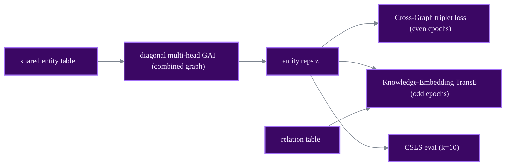

# KECG

GNN + TransE

> **Semi-supervised Entity Alignment via Joint Knowledge Embedding Model and Cross-graph Model**
> Chengjiang Li, Yixin Cao, Lei Hou, Jiaxin Shi, Juanzi Li, Tat-Seng Chua - *EMNLP 2019*
> [:material-file-document: Paper](https://aclanthology.org/D19-1274.pdf) &nbsp;|&nbsp; [:material-code-tags: `models/kecg.py`](https://github.com/Z-Nadjib/EntityAlignment-Nexus/blob/main/code/src/models/kecg.py) &nbsp;|&nbsp; [:material-notebook: notebook](https://github.com/Z-Nadjib/EntityAlignment-Nexus/blob/main/Notebook/04_kecg_dbp15k.ipynb)

!!! abstract "Idea in one sentence"
    Train **two models that share one entity table**: a cross-graph **diagonal multi-head GAT**
    that pulls aligned entities together, and a **TransE knowledge-embedding loss applied to the
    GAT outputs**, alternating between them.

## Architecture

## Components

- **Cross-Graph (CG).** A multi-head GAT with **diagonal weights** (a vector per head, not a full
  matrix), shared across both KGs on one combined graph; ELU between layers, heads averaged.
  Aligned seeds are pulled together with a triplet margin loss and NNS hard negatives.
- **Knowledge-Embedding (KE).** A TransE-style loss applied to the **GAT outputs** (not the raw
  table), which is what guides the attention layers.
- The two objectives **alternate** (CG on even epochs, KE on odd).

## Losses

Cross-graph triplet margin on the GAT reps, plus a TransE loss that reproduces a quirk of the
original repository (it normalises the error vector then sums its components, rather than taking
the true L2 distance):

$$
\mathcal{L}_{\text{KE}} = \text{margin-ranking}\Big(\textstyle\sum \widehat{(z_h + r - z_t)},\; \textstyle\sum \widehat{(z_{h'} + r - z_{t'})}\Big)
$$

## Results

DBP15K `zh_en`, 30% seed.

| | Hit@1 | Hit@10 | MRR |
|---|:---:|:---:|:---:|
| KECG (paper) | 0.477 | 0.835 | 0.598 |
| **This repo** | **0.497** | **0.855** | **0.619** |

<figure markdown>
  { width="640" }
  <figcaption>Test metrics over training (this repo, zh_en).</figcaption>
</figure>

!!! note "Debugging lessons"
    - **The original TransE math "bug" matters**: summing the components of the L2-normalised
      error vector (rather than the true distance) is what the reference repo does, and
      reproducing it is needed to approach the published metrics.
    - **TransE on the GAT outputs**, not on the `nn.Embedding` table, is what pushes gradient
      into the attention layers and reshapes the structural encodings.
    - **Full-volume batching** for the KE step (the 165k combined edges in one batch) is far
      better than aggressive mini-batching.
    - This repo sits ~0.07 under the paper: the exact sparse-GAT NNS that gives the last points
      was approximated.

## References

- Li et al., *Semi-supervised Entity Alignment via Joint Knowledge Embedding Model and Cross-graph Model*, EMNLP 2019.
