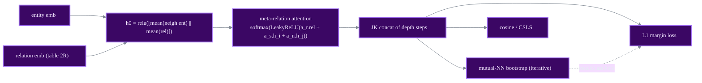

# MRAEA

meta-relation-aware GNN

> **MRAEA: An Efficient and Robust Entity Alignment Approach for Cross-lingual Knowledge Graph**
> Xin Mao, Wenting Wang, Huimin Xu, Man Lan, Yuanbin Wu - *WSDM 2020*
> [:material-file-document: Paper](https://dl.acm.org/doi/10.1145/3336191.3371804) &nbsp;|&nbsp; [:material-code-tags: `models/mraea.py`](https://github.com/Z-Nadjib/EntityAlignment-Nexus/blob/main/code/src/models/mraea.py) &nbsp;|&nbsp; [:material-notebook: notebook](https://github.com/Z-Nadjib/EntityAlignment-Nexus/blob/main/Notebook/08_mraea_dbp15k.ipynb)

!!! abstract "Idea in one sentence"
    A graph attention where the edge logit depends on the **meta-relation** carried by the edge
    (a relation and its **inverse** get distinct embeddings), plus **bi-directional iterative
    self-training** with mutual nearest neighbours.

## Architecture

## Components

- **Meta-relation awareness.** A relation and its inverse get **distinct** embeddings (table
  size $2R$). Each entity starts from
  $h^{(0)} = \text{relu}\big([\,\text{mean}(\text{neigh ent}) \,\|\, \text{mean}(\text{rel})\,]\big)$.
- **Attention** with logit $\text{LeakyReLU}(a_r\!\cdot\!\text{rel}(i,j) + a_s\!\cdot\!h_i + a_n\!\cdot\!h_j)$,
  softmax over neighbours; outputs of all `depth` steps are JK-concatenated.
- **L1 margin loss** with random negatives; **cosine** alignment.
- **Iterative bootstrap.** Every few epochs, **mutual** nearest neighbours among the unaligned
  entities are added as pseudo-anchors (no gold leakage).

## Loss

$$
\mathcal{L} = \big[\gamma + d(l,r) - d(l, r^-)\big]_+ + \big[\gamma + d(l,r) - d(l^-, r)\big]_+,
\quad d(a,b) = \lVert a - b\rVert_1
$$

## Results

DBP15K `zh_en`, 30% seed (left-to-right). **This repo is above the paper in the base setting.**

| | Hit@1 | Hit@10 | MRR |
|---|:---:|:---:|:---:|
| MRAEA base (paper) | 0.638 | 0.882 | 0.729 |
| **This repo (base)** | **0.659** | **0.898** | **0.746** |
| MRAEA +iter (paper) | 0.757 | 0.930 | 0.827 |
| This repo (+iter) | 0.746 | **0.930** | 0.814 |

!!! note "Debugging lessons"
    - The relation channel in $h^{(0)}$ is what makes the representation relation-aware from the
      start - dropping it loses several points.
    - **Bi-directional mutual-NN** bootstrapping (best $l\to r$ **and** $r\to l$) lifts Hit@1 by
      ~9 points without touching gold labels.
    - From-scratch PyTorch port of the official Keras/TF code; the graph builder is shared with
      [RREA](rrea.md).

## References

- Mao et al., *MRAEA*, WSDM 2020.
- Velickovic et al., *Graph Attention Networks*, ICLR 2018.
