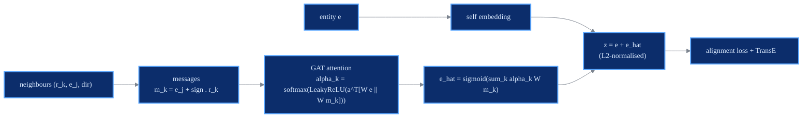

# NAEA

structural + attention

> **Neighborhood-Aware Attentional Representation for Multilingual Knowledge Graph Entity Alignment**
> Qiannan Zhu, Xiaofei Zhou, Jia Wu, Jianlong Tan, Li Guo - *IJCAI 2019*
> [:material-file-document: Paper](https://www.ijcai.org/proceedings/2019/0269.pdf) &nbsp;|&nbsp; [:material-code-tags: `models/naea.py`](https://github.com/Z-Nadjib/EntityAlignment-Nexus/blob/main/code/src/models/naea.py) &nbsp;|&nbsp; [:material-notebook: notebook](https://github.com/Z-Nadjib/EntityAlignment-Nexus/blob/main/Notebook/01_naea_dbp15k.ipynb)

!!! abstract "Idea in one sentence"
    Represent each entity by **fusing its own embedding with an attentional summary of its
    neighbourhood**, where each neighbour message is made *translation-consistent* with TransE,
    then pull aligned pairs together with a saturating margin loss and hard negatives.

## Architecture

## Components

- **Relation level (TransE).** A margin-ranking loss on $f(h,r,t)=\lVert h + r - t\rVert$ with
  negatives corrupted **within the same KG**, capturing each graph's relational structure.
- **Neighbourhood-aware attention.** For an entity $e$, each neighbour contributes a
  *translation-consistent* message $m_k = e_j + \text{sign}\cdot r_k$ ($+1$ for in-edges, $-1$
  for out-edges, so the message reconstructs $e$). A GAT attention weights the neighbours; the
  neighbourhood embedding is $\hat{e}=\sigma\!\left(\sum_k \alpha_k\, W m_k\right)$.
- **Joint representation** $z = e + \hat{e}$, L2-normalised, used for alignment and evaluation.

## Loss

With normalised embeddings the distance lies in $[0, 2]$, so a relative margin collapses the
space. NAEA uses a **limit-based** (absolute-margin) loss that *saturates*:

$$
\mathcal{L}_{\text{align}}
= \big[\, d(z_{e_1}, z_{e_2}) - \gamma_1 \,\big]_+
+ \big[\, \gamma_2 - d(z_{e_1}, z_{e_2^-}) \,\big]_+ \quad(\text{+ symmetric left side})
$$

Once a negative is far enough ($d \ge \gamma_2$) its gradient is zero, so there is no runaway
repulsion even with nearest-neighbour (hard) negatives.

## Training recipe

| Ingredient | Setting | Why it matters |
|------------|---------|----------------|
| Alignment loss | limit-based (absolute margins) | saturates, no collapse |
| Negatives | epsilon-truncated (nearest cross-KG) | the Hit@1 lever |
| Bootstrapping | recomputed every round, never accumulated | avoids error propagation |
| Matching | mutual one-to-one on CSLS | high-precision pseudo labels |
| Eval | CSLS | reduces hubness |

## Results

DBP15K `zh_en`, 30% seed.

| | Hit@1 | Hit@10 | MRR |
|---|:---:|:---:|:---:|
| NAEA (paper) | 0.650 | 0.867 | 0.720 |
| **This repo** | ~0.62 | ~0.86 | ~0.70 |

<figure markdown>
  { width="640" }
  <figcaption>Test metrics over training (this repo, zh_en).</figcaption>
</figure>

!!! note "Debugging lessons"
    - A **relative** margin with normalised embeddings makes MeanRank explode - the limit-based
      loss is what keeps it stable.
    - **Accumulated** bootstrapping propagates early mistakes and collapses after ~100 epochs;
      recomputing the pseudo-set from scratch each round fixes it.
    - **Random** negatives become too easy late in training and cap Hit@1; epsilon-truncated
      hard negatives are the lever.
    - NAEA's published numbers are notoriously hard to match - the independent OpenEA benchmark
      only reaches Hit@1 ~0.31-0.40; this repo lands close to the paper.

## References

- Zhu et al., *NAEA*, IJCAI 2019.
- Bordes et al., *TransE*, NeurIPS 2013.
- Velickovic et al., *Graph Attention Networks*, ICLR 2018.
- Lample et al., *Word Translation Without Parallel Data* (CSLS), ICLR 2018.
