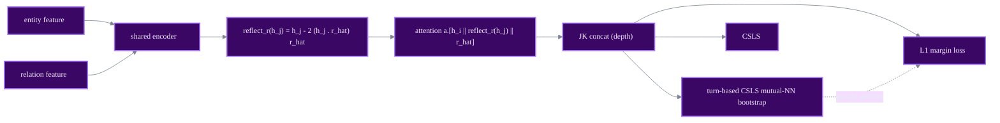

# RREA

relational reflection top performer

> **Relational Reflection Entity Alignment**
> Xin Mao, Wenting Wang, Yuanbin Wu, Man Lan - *CIKM 2020*
> [:material-file-document: Paper](https://arxiv.org/abs/2008.07962) &nbsp;|&nbsp; [:material-code-tags: `models/rrea.py`](https://github.com/Z-Nadjib/EntityAlignment-Nexus/blob/main/code/src/models/rrea.py) &nbsp;|&nbsp; [:material-notebook: notebook](https://github.com/Z-Nadjib/EntityAlignment-Nexus/blob/main/Notebook/09_rrea_dbp15k.ipynb)

!!! abstract "Idea in one sentence"
    The successor of MRAEA: aggregate a neighbour by **reflecting** it across the hyperplane
    orthogonal to the relation vector (a norm-preserving **Householder reflection**), and
    self-train with **turn-based CSLS mutual nearest neighbours**.

## Architecture

## Components

- **Relational reflection.** When node $i$ aggregates neighbour $j$ via relation $r$, the
  neighbour is reflected across the hyperplane orthogonal to the unit relation vector $\hat{r}$:

  $$\text{reflect}_r(h_j) = h_j - 2\,(h_j \cdot \hat{r})\,\hat{r}$$

  a Householder reflection that is **norm- and orthogonality-preserving** (unlike MRAEA's
  additive term).
- **Edge attention** $a \cdot [\,h_i \,\|\, \text{reflect}_r(h_j) \,\|\, \hat{r}\,]$, softmax over
  neighbours (no LeakyReLU). The shared `depth`-layer encoder is run on an entity-based and a
  relation-based feature; outputs are concatenated (JK).
- **Turn-based bootstrap.** Between turns, CSLS **mutual** NN among the unaligned test entities
  are added as pseudo-anchors. `turns: 1` reproduces the basic (non-semi) model.

## Results

DBP15K `zh_en`, 30% seed (left-to-right). **RREA semi matches/beats the paper - the best in this repo.**

| | Hit@1 | Hit@10 | MRR |
|---|:---:|:---:|:---:|
| RREA basic (paper) | 0.715 | 0.929 | 0.794 |
| This repo (basic) | 0.712 | **0.934** | 0.793 |
| RREA semi (paper) | 0.801 | 0.948 | 0.857 |
| **This repo (semi)** | **0.805** | **0.950** | **0.859** |

<figure markdown>
  { width="640" }
  <figcaption>Test metrics over training (this repo, zh_en, semi-supervised).</figcaption>
</figure>

!!! note "Debugging lessons (the decisive fix)"
    - **Match Keras's RMSprop.** PyTorch defaults to `alpha=0.99`; Keras uses `rho=0.9, eps=1e-7`.
      Aligning the optimiser added **~2-3 Hit@1** and was the key to reaching the paper.
    - Reuses MRAEA's graph builder and L1 margin loss - the difference is purely the reflection
      operator and the optimiser/bootstrap schedule.

## References

- Mao et al., *RREA*, CIKM 2020.
- Mao et al., *MRAEA*, WSDM 2020.
- Lample et al., *CSLS*, ICLR 2018.
