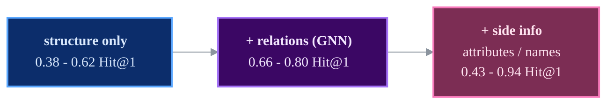

# Results

All numbers are on **DBP15K with the 30% seed split**, the standard protocol. "This repo" values
come from the training runs that produced the curves shown below.
Evaluation is uniform: CSLS (k=10), both directions averaged. DGMC keeps its own top-k matching.

## Headline: `zh_en`

| Model | Family | Hit@1 (paper) | **Hit@1 (here)** | Hit@10 (paper) | **Hit@10 (here)** | MRR (paper) | **MRR (here)** |
|-------|:------:|:----:|:----:|:----:|:----:|:----:|:----:|
| GCN-Align (SE) | structural | 0.384 | 0.363 | 0.703 | 0.679 | - | 0.475 |
| JAPE (SE+AE) | attributes | 0.412 | 0.412 | 0.745 | 0.751 | 0.490 | 0.525 |
| KECG | rel. GNN | 0.477 | **0.497** | 0.835 | **0.855** | 0.598 | **0.619** |
| AliNet | structural | 0.539 | 0.513 | 0.826 | 0.812 | 0.628 | 0.621 |
| BootEA | structural | 0.629 | 0.543 | 0.847 | **0.851** | 0.703 | 0.653 |
| MRAEA (base) | rel. GNN | 0.638 | **0.698** | 0.882 | **0.923** | 0.729 | **0.780** |
| NAEA | structural | 0.650 | 0.628 | 0.867 | 0.860 | 0.720 | 0.711 |
| RREA (basic) | rel. GNN | 0.715 | **0.715** | 0.929 | **0.932** | 0.794 | **0.794** |
| MRAEA (+iter) | rel. GNN | 0.757 | 0.747 | 0.930 | **0.936** | 0.827 | 0.817 |
| DGMC | names | 0.801 | 0.753 | 0.875 | 0.836 | - | 0.783 |
| **RREA (semi)** | rel. GNN | 0.801 | **0.802** | 0.948 | 0.946 | 0.857 | 0.857 |

*Sorted by paper Hit@1. **Bold** = this repo matches or beats the paper.*

All "here" values are re-scored from each run's best checkpoint under one protocol
(CSLS, k=10, both ranking directions averaged) with `python -m src.utils.rescore <run_dir>`.
DGMC keeps its own sparse top-k matching, which is part of the method.

## Reading the landscape

- **Purely structural** models (GCN-Align, AliNet, NAEA, BootEA) top out around 0.4-0.65 Hit@1
  and are the hardest to reproduce exactly - independent benchmarks land well below the papers
  too.
- **Relation-aware GNNs** (MRAEA, RREA) are the strongest structural family; **RREA semi** is the
  best model in this repo and matches/beats its paper.
- **Side information** changes the game: JAPE's attributes push it above the structure-only
  models, and DGMC's entity-name embeddings reach 0.77-0.94 Hit@1.

## Training curves

The figures below are the **curves** produced by the runs in `logs/`.

=== "RREA"
    { width="49%" } { width="49%" }

=== "MRAEA / JAPE"
    { width="49%" }

=== "NAEA / BootEA"
    { width="49%" } { width="49%" }

=== "AliNet / KECG / GCN-Align"
    { width="32%" } { width="32%" } { width="32%" }

!!! tip "Reproduce a number"
    Every run directory keeps `config_used.yaml`, so any number above can be reproduced with
    `python -m src.main --config <that config>`. See [Getting started](getting-started.md).
