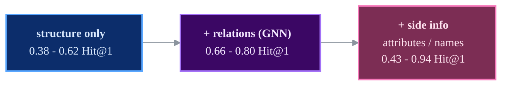
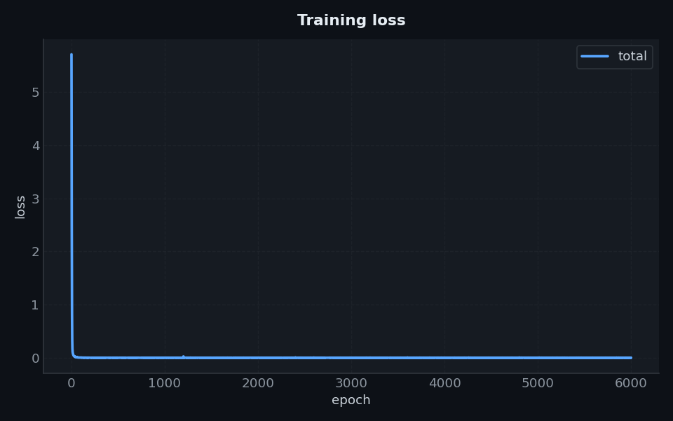
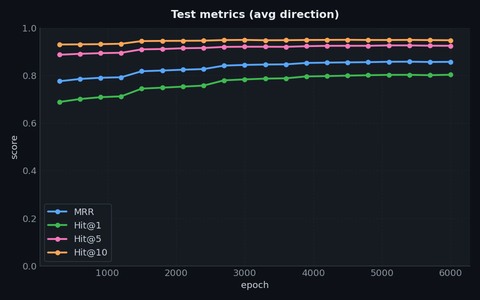
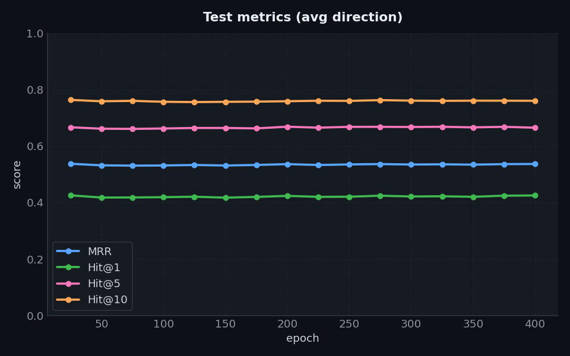
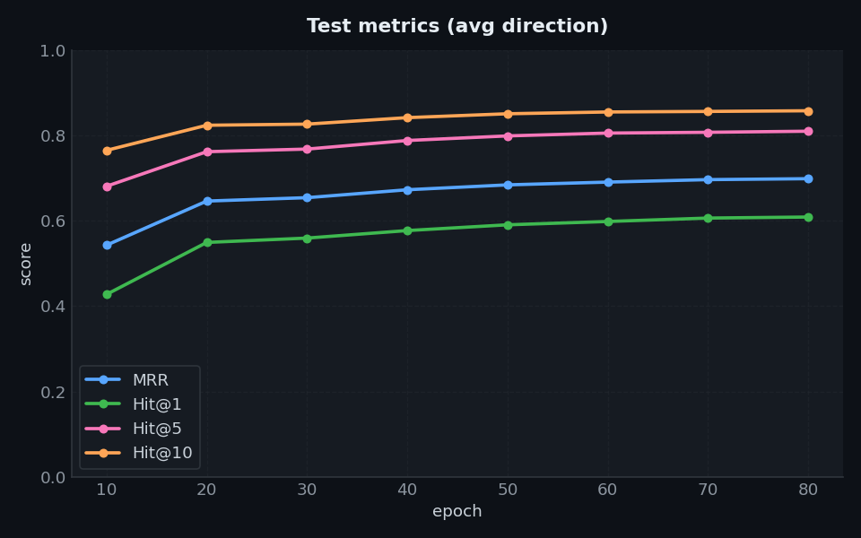
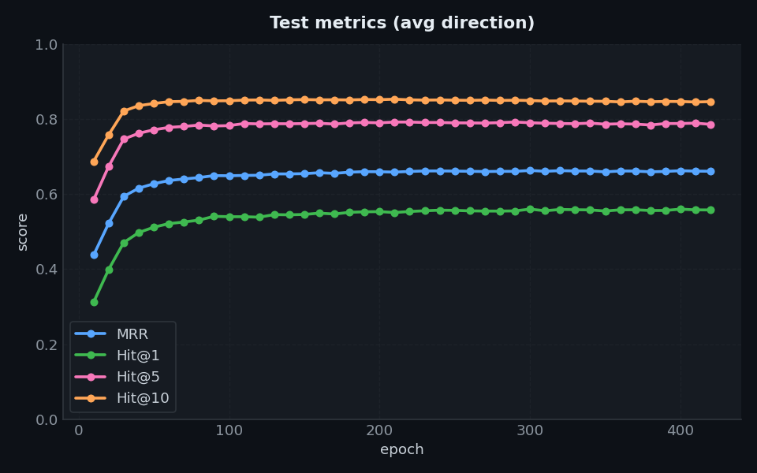
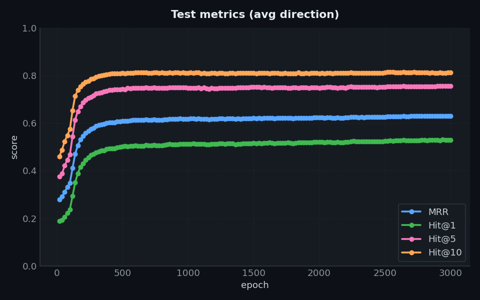
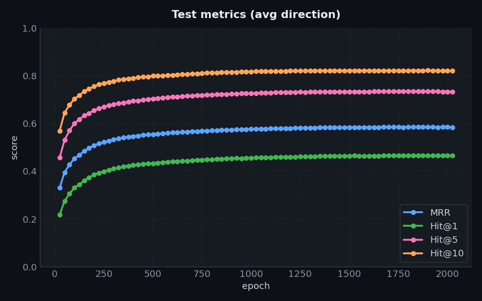
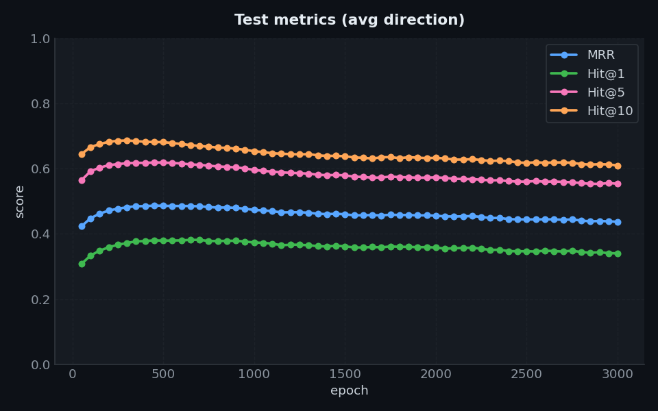

# Results

All numbers are on **DBP15K with the 30% seed split**, the standard protocol. "This repo" values
come from the training runs that produced the curves shown below.
Evaluation uses CSLS unless noted (L1 for GCN-Align, top-k for DGMC).

## Headline: `zh_en`

| Model | Family | Hit@1 (paper) | **Hit@1 (here)** | Hit@10 (paper) | **Hit@10 (here)** | MRR (paper) | **MRR (here)** |
|-------|:------:|:----:|:----:|:----:|:----:|:----:|:----:|
| GCN-Align (SE) | structural | 0.384 | ~0.38 | 0.703 | ~0.68 | - | ~0.49 |
| JAPE (SE+AE) | attributes | 0.412 | **0.425** | 0.745 | **0.761** | 0.490 | **0.537** |
| KECG | rel. GNN | 0.477 | ~0.42 | 0.835 | ~0.73 | 0.598 | ~0.52 |
| AliNet | structural | 0.539 | ~0.53 | 0.826 | ~0.81 | 0.628 | ~0.63 |
| BootEA | structural | 0.629 | ~0.56 | 0.847 | ~0.85 | 0.703 | ~0.66 |
| MRAEA (base) | rel. GNN | 0.638 | **0.659** | 0.882 | **0.898** | 0.729 | **0.746** |
| NAEA | structural | 0.650 | ~0.62 | 0.867 | ~0.86 | 0.720 | ~0.70 |
| RREA (basic) | rel. GNN | 0.715 | 0.712 | 0.929 | **0.934** | 0.794 | 0.793 |
| MRAEA (+iter) | rel. GNN | 0.757 | 0.746 | 0.930 | **0.930** | 0.827 | 0.814 |
| DGMC | names | 0.801 | 0.767 | 0.875 | 0.840 | - | - |
| **RREA (semi)** | rel. GNN | 0.801 | **0.805** | 0.948 | **0.950** | 0.857 | **0.859** |

*Sorted by paper Hit@1. **Bold** = this repo matches or beats the paper.*

## Reading the landscape

- **Purely structural** models (GCN-Align, AliNet, NAEA, BootEA) top out around 0.4-0.65 Hit@1
  and are the hardest to reproduce exactly - independent benchmarks land well below the papers
  too.
- **Relation-aware GNNs** (MRAEA, RREA) are the strongest structural family; **RREA semi** is the
  best model in this repo and matches/beats its paper.
- **Side information** changes the game: JAPE's attributes push it above the structure-only
  models, and DGMC's entity-name embeddings reach 0.77-0.94 Hit@1.

## Training curves

The figures below are the **curves** produced by the runs in `logs/`.

=== "RREA"
    { width="49%" } { width="49%" }

=== "MRAEA / JAPE"
    { width="49%" }

=== "NAEA / BootEA"
    { width="49%" } { width="49%" }

=== "AliNet / KECG / GCN-Align"
    { width="32%" } { width="32%" } { width="32%" }

!!! tip "Reproduce a number"
    Every run directory keeps `config_used.yaml`, so any number above can be reproduced with
    `python -m src.main --config <that config>`. See [Getting started](getting-started.md).
