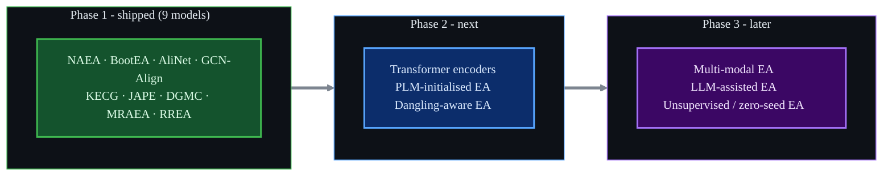

# Roadmap

EntityAlignment-Nexus is built to **grow into the reference hub for entity-alignment models**. The current
release covers nine classic structural, relation-aware, attribute- and name-based methods. The
next wave is **transformer-based** EA.

## Vision

## Planned: transformer-based EA

-   :material-transit-connection-variant: **Self-attention encoders**

    ---

    Graph-transformer aggregators that replace fixed-hop GAT with global attention over the
    neighbourhood (e.g. relation-aware transformer layers on the KG).

-   :material-text-box-multiple: **PLM-initialised alignment**

    ---

    Initialise entity features with pre-trained multilingual language models (mBERT, XLM-R,
    LaBSE) instead of GloVe, in the spirit of BERT-INT / SelfKG.

-   :material-link-off: **Dangling-aware EA**

    ---

    Handle entities with **no** counterpart (the DBP2.0 / dangling setting), a more realistic
    open-world variant of the task.

-   :material-robot-happy: **LLM-assisted EA**

    ---

    Use large language models as candidate re-rankers or verifiers on top of a cheap structural
    retriever.

## Candidate models (shortlist)

| Model | Venue | Why it fits |
|-------|:-----:|-------------|
| **BERT-INT** | IJCAI 2020 | BERT-based interaction model over names/descriptions/attributes |
| **SelfKG** | WWW 2022 | self-supervised, (almost) no seed alignments |
| **Dual-AMN** | WWW 2021 | proxy-attention, very fast and strong on DBP15K |
| **TransEdge** | ISWC 2019 | edge-centric translational embeddings |
| **EVA / MMEA** | AAAI 2021 | multi-modal (images + structure + attributes) |

These are **candidates**, not commitments - priority follows community interest and
reproducibility.

## How to propose or contribute a model

1. Open an issue describing the method and its DBP15K numbers.
2. Add `code/src/models/<your_model>.py` (encoder + loss) following the existing pattern.
3. Add a trainer (or reuse one) in `code/src/trainer.py` and a `configs/<your_model>.yaml`.
4. Add a self-contained notebook and a docs page mirroring the others.

The shared `data.py` / `metrics.py` mean you mostly write the model itself. See
[About & contributing](about.md) for the conventions.

!!! question "Want a specific model next?"
    Tell us which transformer-based EA model you want first - community demand drives the order.
